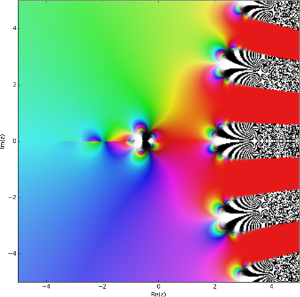

# Hyperoperators

[](https://travis-ci.org/thoppe/python-hyperoperators)
[](https://coveralls.io/github/thoppe/python-hyperoperators?branch=master)
[](https://badge.fury.io/py/hyperop)
  
`hyperop` is a small library for representing really, really, ridiculously large numbers in pure python. It does so using [hyperoperations](https://en.wikipedia.org/wiki/Hyperoperation).

+ Hyperoperation 0, `H0` is the [successor function](https://en.wikipedia.org/wiki/Successor_function), `H0(None, 4) = 5`
+ `H1` is [addition](https://en.wikipedia.org/wiki/Addition), `H1(2,4) = 2 + (1+1+1+1) = 6`
+ `H2` is [multiplication](https://en.wikipedia.org/wiki/Multiplication) (repeated addition), `H2(2,4) = 2+2+2+2 = 8`
+ `H3` is [exponentiation](https://en.wikipedia.org/wiki/Exponentiation) (repeated multiplication), `H3(2,4) = 2*2*2*2 = 16`
+ `H4` is [tetration](https://en.wikipedia.org/wiki/Tetration) (repeated exponentiation) `H4(2,4) = 2^(2^(2^(2))) = 65536`
+ ...
+ Hyperoperation n is repeated Hyperoperation (n-1)


Fundamentally, hyperop works recursively by applying a [fold-right](https://en.wikipedia.org/wiki/Fold_(higher-order_function)) operation:
  
    H[n](x,y) = reduce(lambda x,y: H[n-1](y,x), [a,]*b)


### Installation

    pip install hyperop

To install the latest version use:

    pip install git+https://github.com/thoppe/python-hyperoperators

### Examples

``` python
from hyperop import hyperop

H1 = hyperop(1)
print H1(2,3), H1(3,2), H1(5,4)
# >> 5, 5, 9

H3 = hyperop(3)
print H3(2,3), H3(3,2), H3(5,4)
# >> 8, 9, 625

from math import log
H = hyperop(4)
print H(2,5)
>>> 200352993040684646497....45587895905719156736

print log(log(log(log(H(2,5),2.0),2.0),2.0),2.0) == 2
>>> True  
```
  
Approximate infinite tetration. Show that sqrt(2)^sqrt(2)^... where the tower continues an infinite amount of times is 2.

``` python
H4 = hyperop(4)
print H4(2**0.5, 200)
# >> 2.0
```
  

Calculate the incomprehensibly large, but finite [Graham's number](https://en.wikipedia.org/wiki/Graham%27s_number):

``` python
def GrahamsNumber():
    # This may take awhile...
    g = 4
    for n in range(1,64+1):
        g = hyperop(g+2)(3,3)
    return g
```
  
Plot the phase angle on the complex plane over tetrating four times `H4(z,4)`

``` python
from hyperop import hyperop
import mpmath

H = hyperop(4)
f = lambda z: H(z,4)
mpmath.cplot(f, verbose=True, points=100000)
```



### Bounded hyperoperators

Sometimes, especially in the case of small complex numbers, you only care about numbers that stay bounded during the calculation.
That is, you'd only like to keep the result for some bound z such that `H[n](a,b) <= z`.
The class `bounded_hyperop` does just that:

``` python
from hyperop import bounded_hyperop
Hb = bounded_hyperop(4, bound=1000)
print Hb(2,3), Hb(2,4)
# >> 16 inf
``` 
 
### Caveats
  
Higher order hyperoperations (from tetration and above) are _not_ associative, thus tetration `H4(2,4) = 2^(2^(2^(2))) = 65536` is not `H4(2,4) != 2^(2*2*2) = 256`.

Since tetration is not defined for non-integral heights, the second argument of tetration and both arguments of pentation and above are restricted to non-negative integer values.

### Talks & Press

This library was first presented at DC's Hack && Tell (Feb. 2016).

[http://thoppe.github.io/python-hyperoperators/HnT_pres.html](http://thoppe.github.io/python-hyperoperators/HnT_pres.html#/)

# License

This work is licensed under a <a rel="license" href="http://creativecommons.org/licenses/by-sa/4.0/">Creative Commons Attribution-ShareAlike 4.0 International License</a>.
